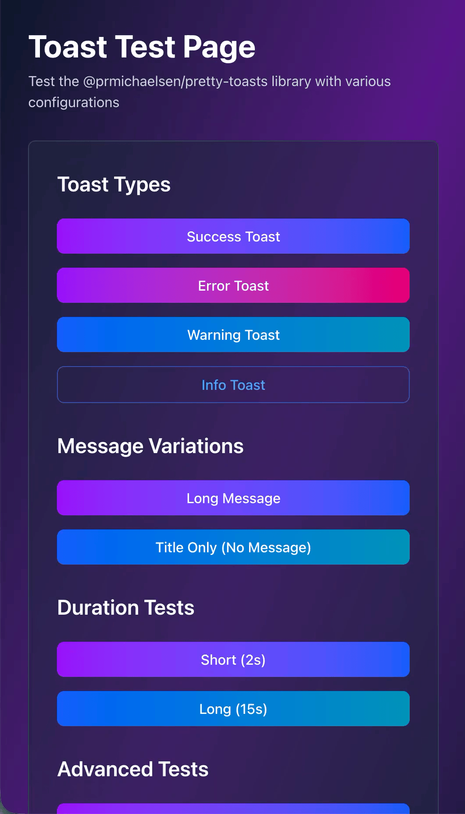

# Pretty Toasts

[](https://www.npmjs.com/package/@prmichaelsen/pretty-toasts)
[](https://opensource.org/licenses/MIT)
[](https://github.com/prmichaelsen/pretty-toasts/actions/workflows/test.yml)
[](https://github.com/prmichaelsen/pretty-toasts/actions/workflows/e2e-tests.yml)
[](https://github.com/prmichaelsen/pretty-toasts/actions/workflows/deploy-demo.yml)
[](https://codecov.io/gh/prmichaelsen/pretty-toasts)
[](https://www.npmjs.com/package/@prmichaelsen/pretty-toasts)
[](https://bundlephobia.com/package/@prmichaelsen/pretty-toasts)

Beautiful gradient toast notifications for React with Redux and standalone support.

## Live Demo

🎮 **Try the interactive demo**: [https://prmichaelsen.github.io/pretty-toasts/](https://prmichaelsen.github.io/pretty-toasts/)

## Features

- 🎨 **Beautiful Gradient Styling** - Purple/indigo for success, purple/rose for error, orange/purple for warning, blue/purple for info
- 🎨 **Custom Theme Support** - Customize gradient colors to match your brand
- 🔄 **Redux & Standalone Support** - Use with Redux Toolkit or standalone React Context
- ⏱️ **Auto-dismiss with Progress Bar** - Configurable duration with visual progress indicator
- 👆 **Interactive Gestures** - Swipe/drag to dismiss, hover to pause, click to make permanent
- 📱 **Responsive** - Works on desktop and mobile with appropriate positioning
- 🎭 **Smooth Animations** - Enter/exit animations with stacking support
- ♿ **Accessible** - ARIA labels and keyboard support

## Installation

```bash
npm install @prmichaelsen/pretty-toasts
# or
yarn add @prmichaelsen/pretty-toasts
# or
pnpm add @prmichaelsen/pretty-toasts
```

### Preview


### Peer Dependencies

```bash
npm install react react-dom
```

For Redux support (optional):
```bash
npm install @reduxjs/toolkit react-redux
```

### ✅ Zero Configuration Required

**This library works out of the box with no CSS configuration needed!** All styles are included as inline styles, so you don't need Tailwind CSS or any other CSS framework.

## Usage

### With Redux

1. Add the toast reducer to your store:

```typescript
import { configureStore } from '@reduxjs/toolkit';
import toastReducer from 'pretty-toasts/store/toastSlice';

export const store = configureStore({
  reducer: {
    prettyToasts: toastReducer,
    // ... other reducers
  },
});
```

2. Add the ToastContainer to your app:

```tsx
import { ToastContainer } from 'pretty-toasts';

function App() {
  return (
    <>
      {/* Your app content */}
      <ToastContainer />
    </>
  );
}
```

3. Use the toast hook:

```tsx
import { useToast } from 'pretty-toasts';

function MyComponent() {
  const toast = useToast();

  const handleClick = () => {
    toast.success({
      title: 'Success!',
      message: 'Operation completed successfully',
      duration: 5000,
    });
  };

  return <button onClick={handleClick}>Show Toast</button>;
}
```

### Standalone (without Redux)

1. Wrap your app with ToastProvider:

```tsx
import { ToastProvider, ToastContainer } from 'pretty-toasts';

function App() {
  return (
    <ToastProvider>
      {/* Your app content */}
      <ToastContainer />
    </ToastProvider>
  );
}
```

2. Use the toast hook:

```tsx
import { useToast } from 'pretty-toasts';

function MyComponent() {
  const { success, error, warning, info } = useToast();

  return (
    <div>
      <button onClick={() => success({ title: 'Success!', message: 'It worked!' })}>
        Success
      </button>
      <button onClick={() => error({ title: 'Error!', message: 'Something went wrong' })}>
        Error
      </button>
    </div>
  );
}
```

## API

### Toast Options

```typescript
interface ToastOptions {
  id?: string;              // Optional custom ID
  type: ToastType;          // 'success' | 'error' | 'warning' | 'info'
  title: string;            // Toast title
  message?: string;         // Optional message
  duration?: number;        // Duration in ms (default: 10000)
  progress?: number;        // Manual progress 0-100 (for uploads, etc.)
}
```

### useToast Hook

```typescript
const toast = useToast();

// Generic toast
toast.toast({ type: 'success', title: 'Title', message: 'Message' });

// Convenience methods
toast.success({ title: 'Success!', message: 'Optional message' });
toast.error({ title: 'Error!', message: 'Optional message' });
toast.warning({ title: 'Warning!', message: 'Optional message' });
toast.info({ title: 'Info', message: 'Optional message' });
```

### Manual Progress Updates (for file uploads, etc.)

```typescript
const uploadId = 'upload-123';

// Start upload toast
toast.info({
  id: uploadId,
  title: 'Uploading...',
  progress: 0,
});

// Update progress
dispatch(updateToast({
  id: uploadId,
  progress: 50,
  message: '50% complete',
}));

// Complete
dispatch(updateToast({
  id: uploadId,
  type: 'success',
  title: 'Upload Complete!',
  progress: 100,
}));
```

## Customization

### Custom Theme Colors

You can customize toast gradient colors to match your brand:

```typescript
import { ToastProvider } from '@prmichaelsen/pretty-toasts/standalone';

const customTheme = {
  toast: {
    success: {
      from: '#10b981', // emerald-500
      to: '#3b82f6',   // blue-500
      opacity: 0.95,
    },
    error: {
      from: '#dc2626', // red-600
      to: '#991b1b',   // red-800
      opacity: 0.95,
    },
    // warning and info will use default colors
  },
};

function App() {
  return (
    <ToastProvider theme={customTheme}>
      <MyApp />
      <StandaloneToastContainer />
    </ToastProvider>
  );
}
```

### Partial Theme Override

You only need to specify the toast types you want to customize:

```typescript
const partialTheme = {
  toast: {
    success: { from: '#10b981', to: '#3b82f6' },
    // error, warning, info use defaults
  },
};
```

### Dark Mode Example

```typescript
const darkTheme = {
  toast: {
    success: { from: '#065f46', to: '#047857', opacity: 0.95 },
    error: { from: '#7f1d1d', to: '#991b1b', opacity: 0.95 },
    warning: { from: '#78350f', to: '#92400e', opacity: 0.95 },
    info: { from: '#1e3a8a', to: '#1e40af', opacity: 0.95 },
  },
};
```

## Styling

The library uses inline styles with beautiful gradient colors. No CSS configuration is required - it works out of the box!

All toast styles are self-contained, so you can use this library with any CSS framework (or none at all).

## License

MIT
